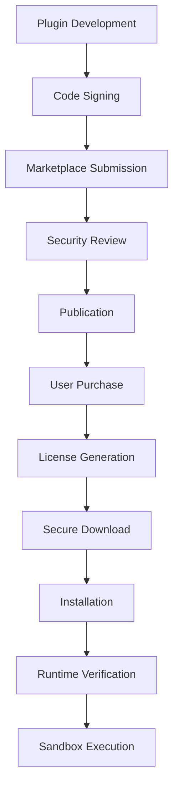

# Plugin System Architecture for Rising-BSM

## Overview

This document outlines the comprehensive plugin system architecture for Rising-BSM, designed to be secure, monetizable, and scalable while preventing piracy and unauthorized distribution.

## Core Principles

1. **Security First**: Every plugin runs in an isolated sandbox with strict resource limits
2. **License Enforcement**: Cryptographic signatures and runtime verification
3. **Performance**: Minimal impact on core application performance
4. **Developer Experience**: Simple SDK with comprehensive documentation
5. **Monetization**: Flexible subscription tiers with usage tracking

## Architecture Components

### 1. Plugin Types

- **UI Plugins**: Extend the dashboard with new components and pages
- **API Plugins**: Add new API endpoints with automatic permission integration
- **Automation Plugins**: Hook into system events and workflows
- **Mixed Plugins**: Combine multiple plugin types

### 2. Security Architecture

#### 2.1 Plugin Packaging & Distribution

```typescript
interface SecurePlugin {
  manifest: PluginManifest;
  code: EncryptedBundle;
  signature: string;
  certificate: PluginCertificate;
  checksum: string;
}
```

#### 2.2 Runtime Security

- **Sandbox Execution**: Isolated V8 context with restricted APIs
- **Resource Limits**: CPU, memory, network, and storage quotas
- **Permission Model**: Explicit grants required for all system access
- **Code Obfuscation**: Plugin code is encrypted and obfuscated

#### 2.3 Anti-Piracy Measures

1. **License Verification**
   - Online verification every 24 hours
   - Offline grace period of 7 days
   - Hardware fingerprinting for license binding

2. **Code Protection**
   - AES-256 encryption of plugin bundles
   - Runtime decryption with license key
   - Anti-debugging measures
   - Code integrity verification

3. **Distribution Control**
   - Plugins served only through authenticated API
   - Download tokens expire after single use
   - IP-based rate limiting
   - Watermarking for forensic tracking

### 3. Plugin Lifecycle



### 4. Database Schema

```prisma
model Plugin {
  id              Int       @id @default(autoincrement())
  uuid            String    @unique @default(uuid())
  name            String    @unique @db.VarChar(100)
  displayName     String    @db.VarChar(200)
  description     String?   @db.Text
  version         String    @db.VarChar(20)
  author          String    @db.VarChar(100)
  authorId        Int
  status          String    @default("pending") // pending, approved, rejected, suspended
  type            String    @db.VarChar(50)
  category        String    @db.VarChar(50)
  tags            String[]
  icon            String?
  screenshots     Json      @default("[]")
  
  // Security
  certificate     String    @db.Text // Plugin certificate
  publicKey       String    @db.Text // For signature verification
  checksum        String    @db.VarChar(64)
  
  // Monetization
  pricing         Json      @default("{}") // Pricing tiers
  trialDays       Int       @default(0)
  
  // Technical
  permissions     Json      @default("[]")
  dependencies    Json      @default("[]")
  minAppVersion   String    @db.VarChar(20)
  maxAppVersion   String?   @db.VarChar(20)
  
  // Metadata
  downloads       Int       @default(0)
  rating          Float     @default(0)
  createdAt       DateTime  @default(now())
  updatedAt       DateTime  @updatedAt
  
  author          User      @relation(fields: [authorId], references: [id])
  licenses        PluginLicense[]
  installations   PluginInstallation[]
  reviews         PluginReview[]
}

model PluginLicense {
  id              Int       @id @default(autoincrement())
  licenseKey      String    @unique @db.VarChar(255)
  pluginId        Int
  userId          Int
  type            String    @db.VarChar(50) // trial, basic, premium, enterprise
  status          String    @default("active") // active, expired, revoked, suspended
  
  // License binding
  hardwareId      String?   @db.VarChar(255) // Hardware fingerprint
  maxInstalls     Int       @default(1)
  currentInstalls Int       @default(0)
  
  // Validity
  issuedAt        DateTime  @default(now())
  expiresAt       DateTime?
  lastVerified    DateTime?
  
  // Usage limits
  usageLimits     Json      @default("{}")
  usageData       Json      @default("{}")
  
  plugin          Plugin    @relation(fields: [pluginId], references: [id])
  user            User      @relation(fields: [userId], references: [id])
  installations   PluginInstallation[]
}

model PluginInstallation {
  id              Int       @id @default(autoincrement())
  pluginId        Int
  licenseId       Int
  userId          Int
  
  // Installation details
  installationId  String    @unique @default(uuid())
  hardwareId      String    @db.VarChar(255)
  version         String    @db.VarChar(20)
  status          String    @default("active") // active, inactive, uninstalled
  
  // Security
  encryptionKey   String    @db.Text // Encrypted with user's key
  lastHeartbeat   DateTime?
  
  // Metadata
  installedAt     DateTime  @default(now())
  lastActivated   DateTime?
  uninstalledAt   DateTime?
  
  plugin          Plugin    @relation(fields: [pluginId], references: [id])
  license         PluginLicense @relation(fields: [licenseId], references: [id])
  user            User      @relation(fields: [userId], references: [id])
  executions      PluginExecution[]
}

model PluginExecution {
  id              Int       @id @default(autoincrement())
  installationId  Int
  action          String    @db.VarChar(100)
  status          String    @db.VarChar(20)
  duration        Int?
  resourceUsage   Json      @default("{}")
  errorMessage    String?   @db.Text
  executedAt      DateTime  @default(now())
  
  installation    PluginInstallation @relation(fields: [installationId], references: [id])
}
```

### 5. Plugin SDK

```typescript
// Plugin Development Interface
export interface RisingBSMPlugin {
  metadata: PluginMetadata;
  
  // Lifecycle hooks
  onInstall?: (context: PluginContext) => Promise<void>;
  onActivate?: (context: PluginContext) => Promise<void>;
  onDeactivate?: () => Promise<void>;
  onUninstall?: () => Promise<void>;
  onLicenseVerified?: (license: LicenseInfo) => Promise<void>;
  
  // Functionality
  routes?: PluginRoutes;
  components?: PluginComponents;
  automationHooks?: AutomationHooks;
  services?: PluginServices;
}

// Secure Plugin Context
export interface PluginContext {
  // Plugin info
  plugin: PluginInfo;
  license: LicenseInfo;
  
  // Sandboxed APIs
  api: SecureAPIClient;
  storage: SecureStorage;
  events: SecureEventBus;
  logger: SecureLogger;
  
  // Resource tracking
  resources: ResourceTracker;
}
```

### 6. Anti-Piracy Implementation

#### 6.1 License Verification Flow

```typescript
class LicenseVerificationService {
  async verifyLicense(
    licenseKey: string,
    hardwareId: string,
    pluginId: string
  ): Promise<LicenseStatus> {
    // 1. Check local cache (max 24 hours)
    const cached = await this.cache.get(licenseKey);
    if (cached && !this.isExpired(cached)) {
      return cached;
    }
    
    // 2. Online verification
    try {
      const response = await this.api.verifyLicense({
        licenseKey,
        hardwareId,
        pluginId,
        timestamp: Date.now(),
        signature: this.generateSignature(licenseKey, hardwareId)
      });
      
      // 3. Validate response signature
      if (!this.validateServerSignature(response)) {
        throw new Error('Invalid server response');
      }
      
      // 4. Update local cache
      await this.cache.set(licenseKey, response, 86400); // 24 hours
      
      return response;
    } catch (error) {
      // 5. Offline grace period check
      if (cached && this.withinGracePeriod(cached)) {
        return { ...cached, offline: true };
      }
      throw error;
    }
  }
}
```

#### 6.2 Plugin Encryption

```typescript
class PluginEncryptionService {
  async encryptPlugin(
    pluginCode: Buffer,
    licenseKey: string
  ): Promise<EncryptedPlugin> {
    // Generate unique encryption key per license
    const encryptionKey = await this.deriveKey(licenseKey);
    
    // Encrypt plugin code
    const encrypted = await crypto.subtle.encrypt(
      { name: 'AES-GCM', iv: this.generateIV() },
      encryptionKey,
      pluginCode
    );
    
    // Add integrity check
    const checksum = await this.calculateChecksum(encrypted);
    
    return {
      data: encrypted,
      checksum,
      algorithm: 'AES-256-GCM'
    };
  }
  
  async decryptPlugin(
    encrypted: EncryptedPlugin,
    licenseKey: string
  ): Promise<Buffer> {
    // Verify integrity
    const checksum = await this.calculateChecksum(encrypted.data);
    if (checksum !== encrypted.checksum) {
      throw new Error('Plugin integrity check failed');
    }
    
    // Decrypt with license key
    const encryptionKey = await this.deriveKey(licenseKey);
    return crypto.subtle.decrypt(
      { name: 'AES-GCM', iv: encrypted.iv },
      encryptionKey,
      encrypted.data
    );
  }
}
```

#### 6.3 Runtime Protection

```typescript
class PluginSandbox {
  private vm: VM;
  private heartbeatInterval: NodeJS.Timer;
  
  async executePlugin(
    plugin: DecryptedPlugin,
    context: PluginContext
  ): Promise<void> {
    // 1. Create isolated VM
    this.vm = new VM({
      timeout: 30000, // 30 seconds max execution
      sandbox: this.createSecureSandbox(context),
      fixAsync: true
    });
    
    // 2. Inject anti-debugging code
    const protectedCode = this.injectProtection(plugin.code);
    
    // 3. Start heartbeat monitoring
    this.startHeartbeat(context.license);
    
    // 4. Execute in sandbox
    try {
      await this.vm.run(protectedCode);
    } finally {
      this.stopHeartbeat();
    }
  }
  
  private injectProtection(code: string): string {
    return `
      // Anti-debugging measures
      (function() {
        const checkDebugger = () => {
          const start = Date.now();
          debugger;
          if (Date.now() - start > 100) {
            throw new Error('Debugger detected');
          }
        };
        setInterval(checkDebugger, 1000);
        
        // Prevent console access
        Object.freeze(console);
        
        // Original plugin code
        ${code}
      })();
    `;
  }
}
```

### 7. Plugin Marketplace

#### 7.1 Submission Process

1. **Developer Registration**: KYC verification for plugin developers
2. **Code Review**: Automated and manual security review
3. **Testing**: Automated testing in sandboxed environment
4. **Certification**: Digital signing with Rising-BSM certificate

#### 7.2 Distribution

```typescript
class PluginDistributionService {
  async downloadPlugin(
    userId: number,
    pluginId: number,
    licenseKey: string
  ): Promise<SecureDownloadUrl> {
    // 1. Verify license ownership
    const license = await this.verifyOwnership(userId, pluginId, licenseKey);
    
    // 2. Generate one-time download token
    const token = await this.generateDownloadToken({
      userId,
      pluginId,
      licenseKey,
      expires: Date.now() + 300000 // 5 minutes
    });
    
    // 3. Prepare encrypted plugin bundle
    const bundle = await this.prepareBundle(pluginId, licenseKey);
    
    // 4. Return secure download URL
    return {
      url: `/api/plugins/download/${token}`,
      expires: token.expires,
      checksum: bundle.checksum
    };
  }
}
```

### 8. Monitoring & Analytics

#### 8.1 Usage Tracking

```typescript
interface PluginUsageMetrics {
  installations: number;
  activeUsers: number;
  apiCalls: number;
  resourceUsage: {
    cpu: number;
    memory: number;
    storage: number;
  };
  errors: number;
  performance: {
    avgResponseTime: number;
    p95ResponseTime: number;
  };
}
```

#### 8.2 Security Monitoring

- License verification failures
- Suspicious usage patterns
- Resource limit violations
- Unauthorized API access attempts

### 9. Implementation Phases

#### Phase 1: Foundation (Weeks 1-4)
- Core plugin infrastructure
- Basic sandboxing
- Database schema implementation
- License generation system

#### Phase 2: Security (Weeks 5-8)
- Encryption implementation
- Anti-piracy measures
- Sandbox hardening
- Security testing

#### Phase 3: Developer Tools (Weeks 9-12)
- Plugin SDK
- CLI tools
- Documentation
- Sample plugins

#### Phase 4: Marketplace (Weeks 13-16)
- Marketplace UI
- Submission workflow
- Review process
- Payment integration

#### Phase 5: Launch (Weeks 17-20)
- Beta testing
- Security audit
- Performance optimization
- Production deployment

## Conclusion

This plugin system architecture provides a secure, scalable foundation for extending Rising-BSM while protecting intellectual property and enabling monetization. The multi-layered security approach ensures plugins cannot be pirated or reverse-engineered, while the developer-friendly SDK encourages a thriving ecosystem.